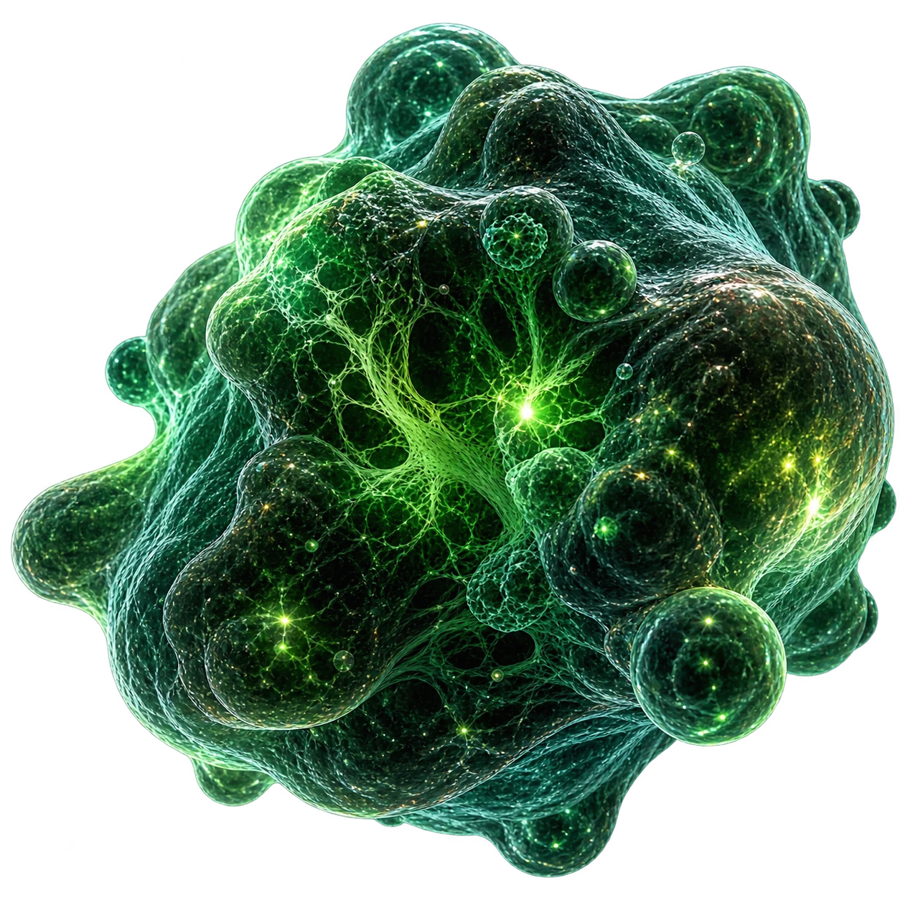

<div align="center">



# NOVA/GEN

**Biology, made programmable.**

A single-page, scroll-driven experience for a fictional computational-biology company —
built as one continuous scientific narrative rather than a stack of landing-page blocks.

`React 19` · `TypeScript` · `Vite 8` · `GSAP + ScrollTrigger` · `Three.js / R3F` · `Lenis` · `Zustand` · `Tailwind 4`

</div>

---

## The idea

Every scroll pixel advances one story:

```
LIFE  →  EXPLORE  →  DECODE  →  INTERPRET  →  DISCOVER  →  IMPACT
```

The page opens on a living organism, dives through a cell cluster into the nucleus, dissolves
biology into a particle field, resolves those particles into genetic signal, assembles the signal
into a research network, and finally condenses the network into a molecular candidate — then
carries that same visual language through platform, capabilities, research and impact.

The design brief is deliberately narrow: dark microscopic environments, bioluminescent green,
mint rim light, editorial type, scientific metadata, controlled negative space. No purple
gradients, no glassmorphism, no DNA-helix hero.

---

## Quick start

Requires **Node ≥ 20.19** (or ≥ 22.12) and **pnpm**.

```bash
pnpm install
pnpm dev            # http://localhost:5173
```

Production:

```bash
pnpm build          # tsc -b && vite build  →  dist/
pnpm preview
```

### Scripts

| Command | What it does |
|---|---|
| `pnpm dev` | Vite dev server with HMR |
| `pnpm build` | Type-check the project references, then bundle to `dist/` |
| `pnpm typecheck` | `tsc -b --noEmit` — strict, with `noUnusedLocals` / `noUnusedParameters` |
| `pnpm lint` | Oxlint |
| `pnpm test` | Vitest — 114 unit tests over the geometry and timing math |
| `pnpm assets` | Re-encode source PNGs into the shipped WebP set (requires the raw sources) |
| `pnpm preview` | Serve the production build |

---

## Architecture

```
src/
├─ app/App.tsx            Lenis + ScrollTrigger wiring, section order, resize policy
├─ main.tsx               React root
│
├─ sections/              DOM: one folder per page section
│  ├─ Hero/               Pinned hero, organism plate, magnetic CTA
│  ├─ Journey/            The seven-state biological journey (pinned, ~460vh)
│  ├─ Innovation/         Aperture handoff out of the journey + microscopy field
│  ├─ Technology/         Five-stage platform pipeline (Sample → … → Validate)
│  ├─ Capabilities/       Four capability modules with per-module visuals
│  ├─ Research/           Three study figures with spotlight + annotations
│  ├─ Impact/             Metric counters, confidence arc, human moment
│  └─ Cta/                Closing cell formation + contact
│
├─ scene/                 WebGL: one <Canvas>, many scenes
│  ├─ ExperienceCanvas    Single R3F canvas; sizes every buffer from the device tier
│  ├─ CanvasRuntime       Adaptive DPR + frameloop parking
│  ├─ Journey/            Particle system, dissolve stage, candidate reveal
│  ├─ Technology/         Platform field, confidence rings, specimen, validation
│  ├─ Impact/             Signal network + seed
│  ├─ Cta/                Closing cell
│  └─ */shaders.ts        GLSL for each scene
│
├─ animation/             One GSAP timeline builder per section (pure, ref-driven)
├─ store/                 Zustand store + a mutable scrollProgress ref
├─ hooks/                 useActiveSection, useMediaQuery, useReducedMotion
├─ lib/                   deviceTier, scroller, viewport, sections, anchorNav
└─ styles/                Design tokens + one stylesheet per section
```

### Who owns what

The split is strict, and it is the main thing to understand before editing:

| Layer | Owns | Never does |
|---|---|---|
| **GSAP / ScrollTrigger** | Scroll choreography, pinning, type reveals, counters, DOM transitions | Drive WebGL per-frame state directly |
| **React Three Fiber** | Particles, networks, signals, shader effects | Read scroll from the DOM |
| **Lenis** | Smooth scrolling only, driven off the GSAP ticker | Own any animation |
| **Zustand** | Discrete shared state — device tier, active section, current stage, canvas on/off | Carry per-frame values |

Per-frame scroll values never travel through React. GSAP writes them into a plain mutable object
(`src/store/progressRef.ts`) and the R3F scenes read it inside `useFrame`:

```
ScrollTrigger.onUpdate  →  scrollProgress.journey = self.progress
                                     ↓  (no re-render)
        useFrame        →  uniforms.uProgress.value = scrollProgress.journey
```

Zustand is reserved for state that changes a handful of times per page — a store write per frame
would re-render the tree sixty times a second.

Both objects are exposed on `window` in dev (`__scrollProgress`, `__experience`, `__lenis`), so any
stage can be scrubbed and inspected from the console.

---

## Performance

The page runs a full-screen WebGL canvas behind eight sections of scroll animation, so the budget
is resolved once and everything downstream sizes itself from it.

**Device tiers.** `resolveDeviceTier()` reads `hardwareConcurrency`, `deviceMemory`, pointer type
and screen size to pick `high` / `mid` / `low`. It is resolved before anything reads it — a tier
arriving one frame late would build the whole page at the wrong budget and then rebuild it.

| | high | mid | low |
|---|---|---|---|
| Geometry scale | 1.0 | 0.68 | 0.42 |
| DPR (initial / min / max) | 1.5 / 1.25 / 1.75 | 1.25 / 1 / 1.5 | 1 / 0.85 / 1.15 |
| Journey particles, desktop | 6 000 | 4 080 | 2 520 |

Counts are cut by breakpoint *before* the tier scale applies — mobile runs 1 000 journey particles
at tier scale, and the Technology, Impact and CTA scenes do not mount on mobile at all.

**Adaptive DPR.** `CanvasRuntime` wraps drei's `PerformanceMonitor`; sustained decline steps DPR
down by 0.25 within the tier's clamp, recovery steps it back up.

**Frameloop parking.** Capabilities and Research are DOM-only. Entering that band sets
`canvasActive: false`, which flips the R3F frameloop to `never` — the GPU idles completely through
two full sections and resumes on the way out.

**Resize policy.** iOS fires `resize` every time its URL bar collapses under a scroll gesture. A
`ScrollTrigger.refresh()` there re-measures every pinned section mid-gesture and the page shifts
under your thumb. On coarse pointers only a *width* change counts as a real layout change;
height-only resizes are ignored (`ScrollTrigger.config({ ignoreMobileResize: true })` plus a width
guard and a debounce).

---

## Accessibility

- **`prefers-reduced-motion` is a first-class path**, not a disable switch. The journey renders
  `JourneyStatic` — the same seven states as readable stacked content — and the heavy scenes never
  mount. Every timeline builder takes a `reduced` flag and sets its final state directly.
- Copy is readable without any animation; nothing meaningful lives only in a WebGL layer.
- The canvas is `aria-hidden` and `pointer-events: none` — decoration by construction.
- Sections carry real landmarks and labels, the header nav maps to `SECTION_IDS`, and anchor
  navigation routes through Lenis with a header offset.

---

## Design system

Tokens live in `src/styles/tokens.css`.

| Token | Value | Use |
|---|---|---|
| `--color-abyss` | `#07110F` | Page ground |
| `--color-deep-tissue` | `#0E1D17` | Surfaces |
| `--color-bio-green` | `#A6FF6A` | Primary / bioluminescence |
| `--color-signal-mint` | `#C6F5E1` | Accent, rim light, metadata |
| `--color-bone` | `#F5F7F4` | Text |
| `--color-muted` | `#8D9B93` | Secondary text |

Type: **Space Grotesk** for display, **JetBrains Mono** for scientific metadata (uppercase,
11–12px, 0.08–0.14em tracking). Layout: 1440px max content width, 48–72px desktop padding, 32px
tablet, 20px mobile — mobile is a re-composition, not a vertical stack of the desktop layout.

---

## Assets

Story imagery is generated, then compressed into the committed WebP set by
`scripts/build-assets.mjs` (sharp): fixed widths, per-asset quality, alpha preserved where a plate
has to composite over the scene. The script skips any job whose raw source is absent, so
`pnpm assets` is safe to run with a partial source set.

Everything procedural — particles, networks, genetic signal, HUD, reticles, grids, glows — is built
in Three.js, SVG or CSS and never shipped as an image. The hero organism is preloaded at high fetch
priority; the next two journey plates are prefetched.

---

## Verification

```bash
pnpm test        # 114 tests across 11 files
pnpm typecheck
pnpm lint
```

Unit tests cover what is easy to break silently and hard to eyeball: particle target layouts,
journey / technology / impact stage timing, capability and hero geometry, research figure math,
CTA constants.

Beyond that, `scripts/` holds Playwright probes used during development against a running dev
server (`--url`, default `http://localhost:5180`):

| Probe | Checks |
|---|---|
| `visual-check.mjs` | Screenshots every scroll stop across seven viewports into `screens/` |
| `probe-jank.mjs`, `probe-profile.mjs`, `probe-paint.mjs` | Frame timing, long tasks, paint cost |
| `probe-gl.mjs`, `probe-renders.mjs` | WebGL context / renderer, React render counts |
| `probe-reduced.mjs` | The reduced-motion path |
| `probe-<section>.mjs` | Per-section layout and state |

Run one with, for example:

```bash
node scripts/visual-check.mjs --url http://localhost:5173 --only 1440x900
```

---

## Docs

The creative brief is versioned alongside the code in [`docs/`](docs/):

| Document | Contents |
|---|---|
| [`NOVA_GEN_Creative_Frontend.md`](docs/NOVA_GEN_Creative_Frontend.md) | Product goal, stack, animation ownership, visual identity |
| [`PAGE_STRUCTURE.md`](docs/PAGE_STRUCTURE.md) | Page flow, per-section specification, responsive rules |
| [`DESIGN_SYSTEM.md`](docs/DESIGN_SYSTEM.md) | Composition, typography, surface treatment |
| [`MOTION_STORY.md`](docs/MOTION_STORY.md) | The seven journey states and how they connect |
| [`ASSET_MANIFEST.md`](docs/ASSET_MANIFEST.md) | Every asset, its status, and how it is used |
| [`ACCEPTANCE_CRITERIA.md`](docs/ACCEPTANCE_CRITERIA.md) | Definition of done, viewports, verification loop |

---

## Notes

- NOVA/GEN is a **fictional company**. All metrics, studies and figures are portfolio
  demonstration content and describe nothing real.
- `screens/` (probe output) and `dist/` are ignored; the committed `public/assets/` set is the
  source of truth for imagery.
- WebGL is required for the full experience. Without it — or under reduced motion — the page
  degrades to the static narrative rather than breaking.
